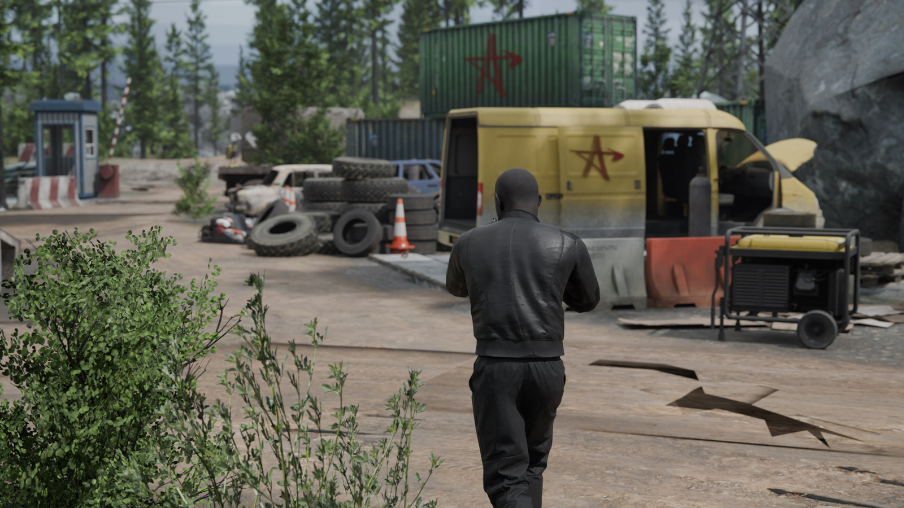
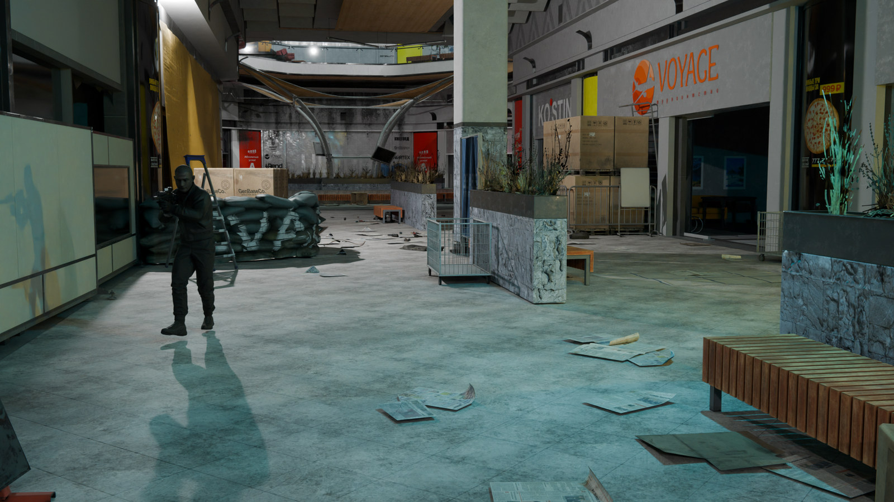
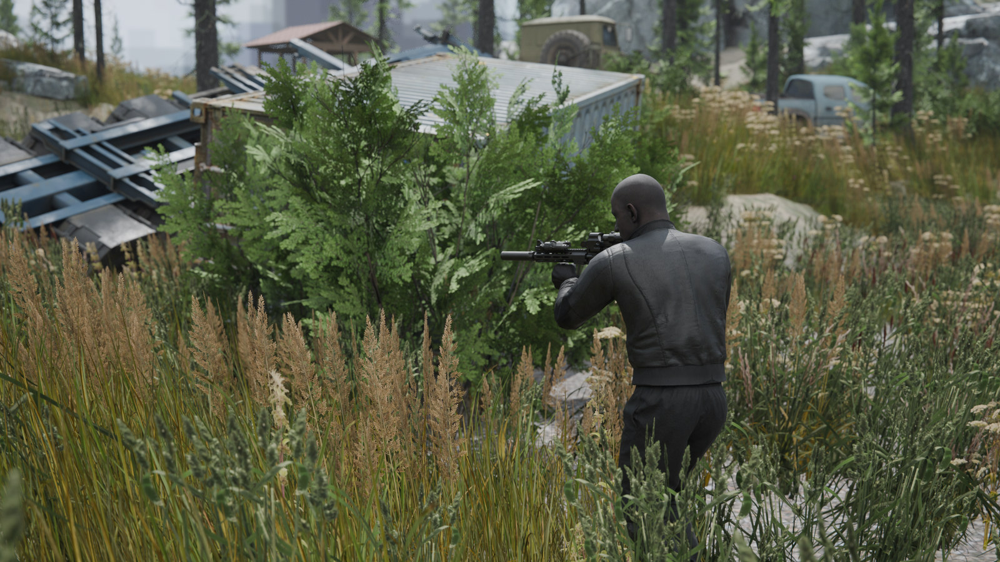
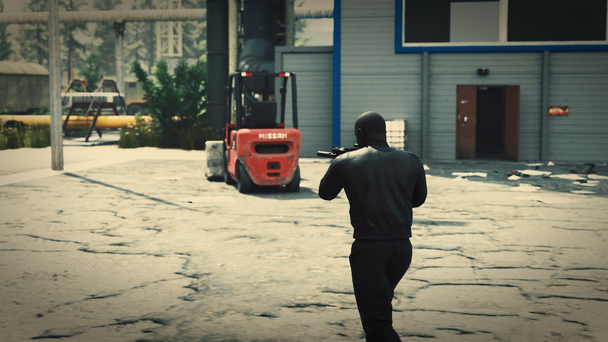
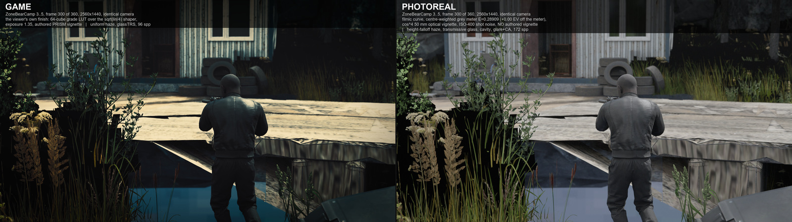

# Atlas

A native **Escape from Tarkov map viewer** for Windows and Linux. Everything on screen is
extracted from the game's own files — geometry, lights, water, glass, loot, fire — and rendered
by a GPU-driven Rust/Bevy engine: compute culling with Hi-Z occlusion, bindless materials,
cascaded shadows, baked SH global illumination, SSAO / SSR / TAA, volumetric sun shafts.

The images below are offline Cycles renders of the same extracted packs, built by the Blender
importer in `tools/blender/`. They are not viewer frames.



*Interchange, the checkpoint on the ZoneBearCamp forest road. Photoreal mode.*



*Interchange, the ULTRA mall central square. Photoreal mode.*



*Interchange, the wooded ZoneBearCamp bot zone. Photoreal mode.*



*Interchange, the power station yard. Game-accurate mode, finished with the game's own colour
grade.*



*One camera, both modes: game-accurate on the left, photoreal on the right.*

## Overlay mode

Atlas can put the map **over the running game**, standing exactly where you are.


**How it opens.** You press your own **in-game screenshot key**. Tarkov writes your position into
the screenshot's filename; Atlas watches for that file, turns it into a position fix, and raises
the overlay already framed on where you stand. There is deliberately **no global hotkey and no
input injection** — a registered hotkey would swallow that key machine-wide so the game never saw
it, a keyboard hook would observe every keystroke you type, and synthetic input is exactly what
anti-cheat looks for. The screenshot flow needs none of those, so Atlas listens to a file and
nothing else.

**How it lines up.** The panel is not a separate view of the map: Atlas projects the slice of the
world your window covers with an asymmetric frustum, so a tree on the overlay sits at the same
screen position as the tree behind it. The window itself is the same one Atlas always draws into —
no second window, no second renderer — it simply drops its decorations, goes always-on-top, and
resizes against the game's client rect.

**How it closes.** The big **BACK TO TARKOV** button, or `~` while Atlas has focus. Either
minimises Atlas so Windows hands the foreground straight back to the game. The dismiss key is
configurable in the settings panel.

**One requirement:** the game must be in **windowed** or **borderless** mode. Nothing can be drawn
over exclusive fullscreen — that's a platform rule, not something a program can work around.

## Run

Grab a build from Releases, unzip it, and **double-click `atlas.exe`** — it opens a menu where you
pick a map and build or load its pack. No command line needed.

If you prefer one, you can point it straight at a pack instead:

```
atlas.exe packs/<map>.eftpack
```

Packs are built from your own game install (the menu's build button, or
`python tools/build_map.py <map> --alllod`). Game-derived data never ships with this repository.

On Windows, `scripts\Build All Atlas Maps.cmd` runs every map in a resumable queue, skipping packs
that already have a completed manifest. Configure `EFT_ATLAS_ROOT`, `EFT_GAME_DATA`,
`EFT_ASSETS_ROOT`, and `EFT_TARKMAP_ROOT`, or put the corresponding `AtlasRoot`, `GameData`,
`AssetsRoot`, and `TarkmapRoot` values in the ignored
`scripts\build-all-atlas-maps.local.psd1`. Keep Tarkov closed during extraction.

## Remote renderer (experimental)

Atlas can render in a GPU-equipped Windows/Linux VM while Tarkov remains on the gaming PC. The
remote viewer needs the same prebuilt `.eftpack`; a screenshot only supplies a camera position and
orientation, so the screenshot image itself does not need to cross the network.

On the render VM, create a marker inbox and launch Atlas with remote mode enabled:

```powershell
$env:EFT_REMOTE_MODE = "1"
$env:EFT_SCREENSHOTS_DIR = "C:\AtlasRemote\Screenshots"
# Optional: a read-only SMB share of Tarkov's Logs root for automatic map/FOV/task updates.
$env:EFT_GAME_LOGS_DIR = "\\GAMING-PC\EFT-Logs"
# Safe ONLY for a marker-only inbox; remote mode otherwise never deletes shared screenshots.
$env:EFT_DELETE_PROCESSED_SHOTS = "1"
atlas.exe packs\woods.eftpack
```

Run the filename-only relay on the gaming PC (the inbox may be an SMB share on the VM):

```powershell
.\scripts\remote-screenshot-relay.ps1 `
  -SourceDir "$env:USERPROFILE\Documents\Escape From Tarkov\Screenshots" `
  -InboxDir "\\ATLAS-VM\AtlasRemote\Screenshots"
```

The relay creates zero-byte `.png` markers carrying EFT's original filename; it never reads,
copies, changes, or deletes the screenshot itself. Atlas ignores files that existed before either
process started. `EFT_GAME_LOGS_DIR` may point either to the shared `Logs` directory or directly to
one current `log_*` session directory. Without shared logs, select the correct pack manually.

For the first Proxmox proof of concept, pass one GPU through to a Windows 11 VM, install a Vulkan-
capable NVIDIA driver, run Atlas in a normal console desktop, and stream that desktop with
Sunshine/Moonlight. Microsoft RDP is not the target presentation path because Atlas deliberately
uses Vulkan and needs the passed-through GPU to own the displayed desktop.
